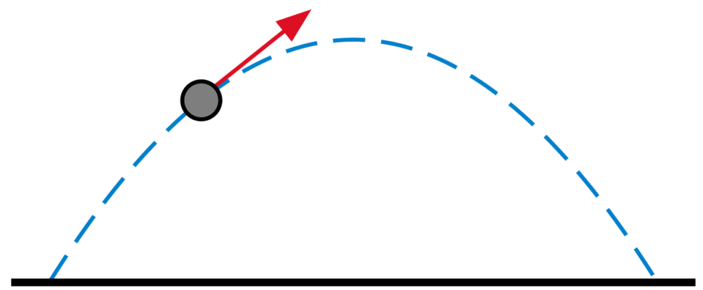
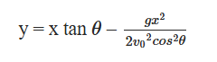
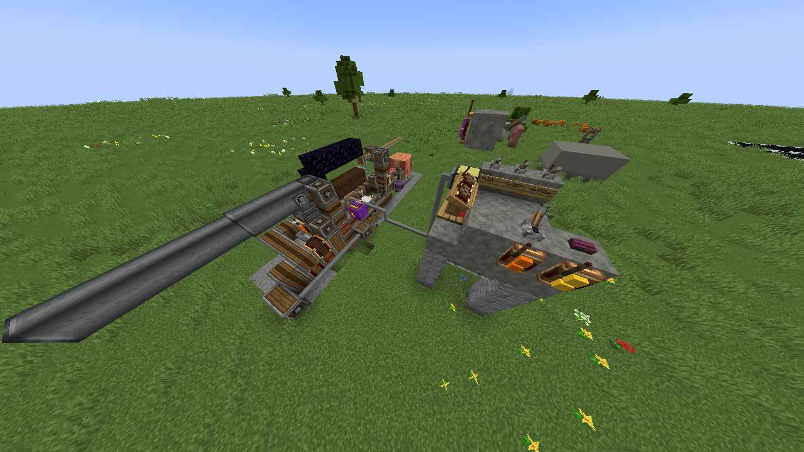
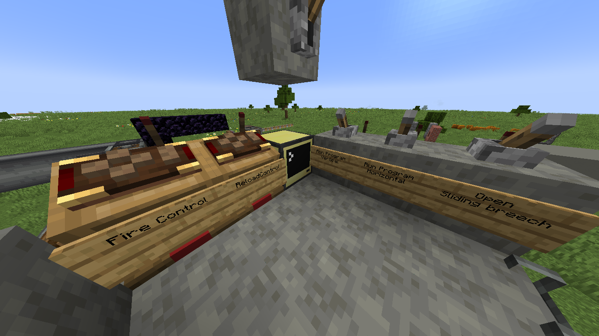
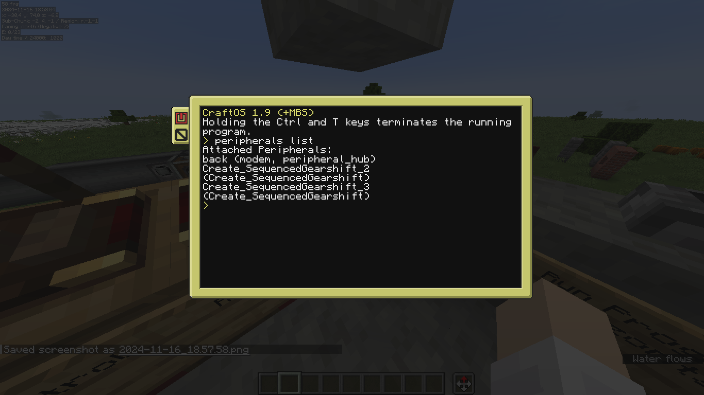

# precise artillery for the create mod

## mods used
- create
- cc:tweaked
- create additions

## formula
  
The formula to simple trajectories is the following :  
  

**y** = refers to the vertical position of the object in meters  

**x** = refers to the horizontal position of the object in meters  

**v0** = refers to the initial velocity of the object combined with meter per second  

**g** = refers to the acceleration due to gravity that is 9.80 m/s2  

**θ** – refers to the initial angle from the horizontal plane in degrees or radians.  

## acquring target position
we currently have no methods of obtaining the position for a "block" or a "target"  

we will use already known coordinates in the mean time

*Eg:*  
let's say we have a block at position x=100
what is y?

let's brute force !  

vel=(3,3)
while True:  
y=x\*tan(i)-(gx^2)/(2\*vel^2*cos(i)^2)  
end

*please do fix my equation, it's broken haha !*

## the setup

canon:  
  

controls:  
  

## let's get coding !

We will create a new file :
[canon_controller.lua](src/computer_0/canon_controller.lua)
in here we will define controls for resetting pitch and yaw, setting canon rotation etc...

In a second file we will define functions for calculating canon angles.

In a third file called "main" we will connect all modules

And finally we will have a command line interface

### canon controls
 

we have two peripherals...
they both contain three methods :  
rotate: int  
move: int  
is_running(): bool  

we will need two make a few more :  
reset_angle()  
calibrate()  

